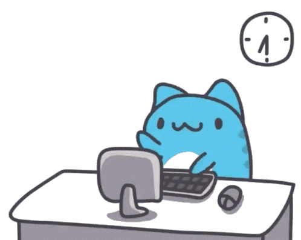
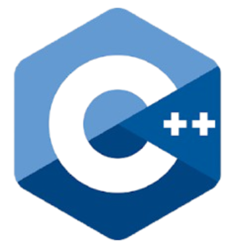
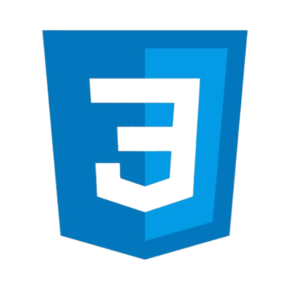
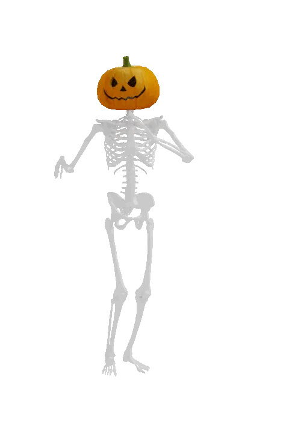

  

###

   
     
     

<h3 align="center">hey there 👋</h3>
<h3 align="center">I'm Jonathan Dionisio</h3>
<h3 align="center">Currently studying Bachelor of Science in Information Technology with a specialization of Mobile and Web Application in National University Manila </h3>

###

<h3 align="center">👩‍💻  About Me</h3>

###

Im mobile and game dev enthusiast, I would love to develop multiple games that I have in my vast imagination. But I think Im kinda busy for making those games for now, but I will develop it when I graduate from collge.   -Im also looking for experience and opportunities in any game development stuff. I would love to land a job position as a game developer in the future.  - Please do reach me out if you can help me out with this requirements that I want in my life 👩‍💻  

  

###

<h3 align="center">🛠 Language and tools</h3>

###

 

  
  
    
  
   
  
   
  
   
  
   
  
   
  
   
  
   
  
   
   
  
   
  
   
  
   
  
   
  
   
  
   
  
   
  
   
  

  

  
  
  

 

###

  
  

 

<h3 align="center">Checkout my portfolio</h3>

 

  
  

