

  <a href = "https://jonathandionisio.vercel.app/">
  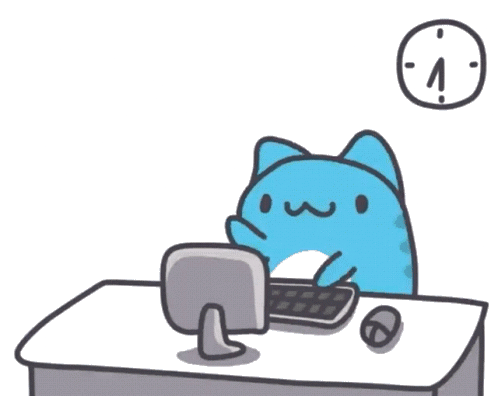
  </a>
  
Press the working cat to see my Portfolio

###

  <a href = "https://www.linkedin.com/in/jonathan-dionisio-0845392ab/">
  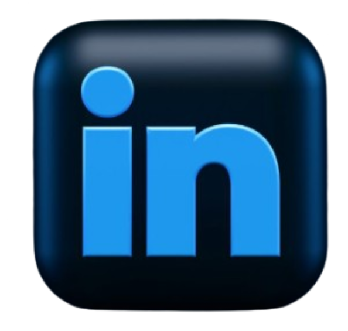
  </a> 
     
   <a href = "https://www.instagram.com/ebisuuu_/">
  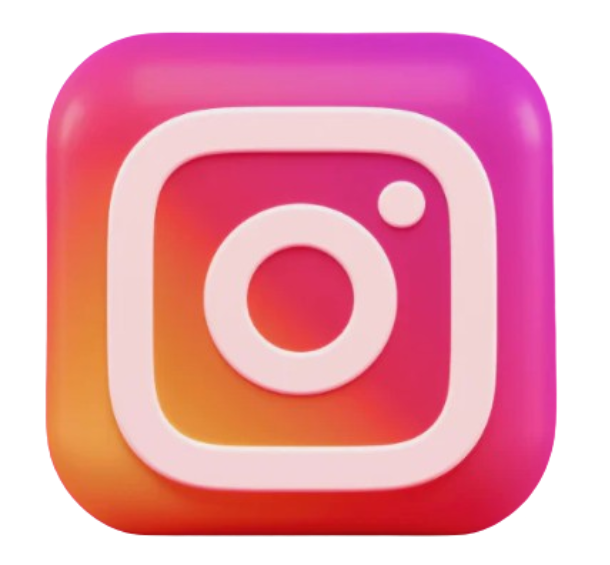
  </a>  

<h2 align="center">yow👋, I'm Jonathan Dionisio, most people call me Nathan and in the internet known as Ebisu</h2>

###

<h3 align="center">👩‍💻 About Me</h3>

 I’m a BSIT-MWA graduate and a passionate game enthusiast with a strong interest in technology, software development, and interactive applications. 
 
 I’m currently looking for opportunities in <strong>software development, IT support, and the game industry</strong>, including roles in <strong>game development and game testing</strong>. 
 
 I’m eager to apply my technical knowledge, continue developing my skills, and gain hands-on experience while contributing to real-world projects. I’m open to both <strong>full-time and internship opportunities</strong> and always willing to learn, adapt, and take on new challenges. 
 
 🎮 My long-term goal is to build meaningful and engaging games while growing as a developer and exploring the many possibilities of technology. 
   <h3 align="center">💼 Experience & Education</h3>

 

<h2> IT support Intern — Concentrix </h2>

📅 November 2025 – January 2026

Worked on different technical supporting on agents with their various technical, hardware and network issue. Assisted different IT support seniors with their minor and major everyday tasks.

Gained experience in Vital Hardware knowledge, Basic and structured networking and security, communicating and handling issues with agents in a BPO company .

 

<h2> Full Stack Mobile & Web Developer Intern / Project Lead Intern — Nexvision Innovations Inc. </h2>

February 2026  – May 2026

Assisted and contributed with Developing a mobile and web project BazaarX for the company's client, I worked and communicated with several developers, clients and QAs. Reported different updates regarding with the projects to the client. Became a project lead Intern, obtaining a few responsibilities like handling and assigning tasks for different developers and QAs while communicating with the client and project manager.

Worked with Github, Git, ExpoGo and Jira.

Learned and improved my skills in Typescript, Javascript and Supabase.

 

<h2> 🎓 Education </h2>

🏫 National University Manila
Bachelor of Science in Information Technology — Major in Multimedia and Web Applications (BSIT-MWA)
📅 2022 – 2026

🌱 Currently Looking For Job Opportunities:

<ul>
  <li>💻 Software Development opportunities</li>
  <li>🛠️ IT Support roles</li>
  <li>🎮 Game Development opportunities</li>
  <li>🧪 Game Testing / QA opportunities</li>
  <li>🚀 Internship and entry-level positions</li>
  <li>📚 Opportunities to learn, grow, and gain hands-on experience</li>
</ul>

 

 <strong>I’m always open to new opportunities, collaborations, and challenges. Feel free to reach out! 👩‍💻🎮</strong> 

  

###

<h3 align="center">🛠 Language and tools</h3>

###

 

  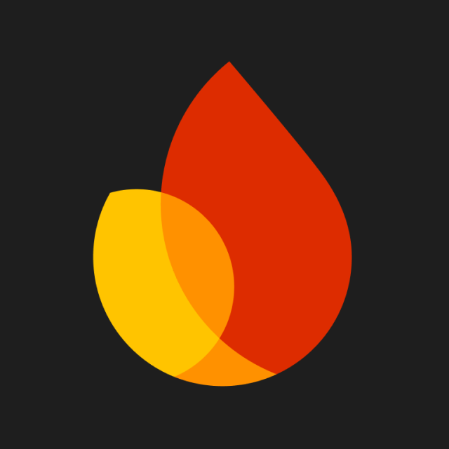
  
    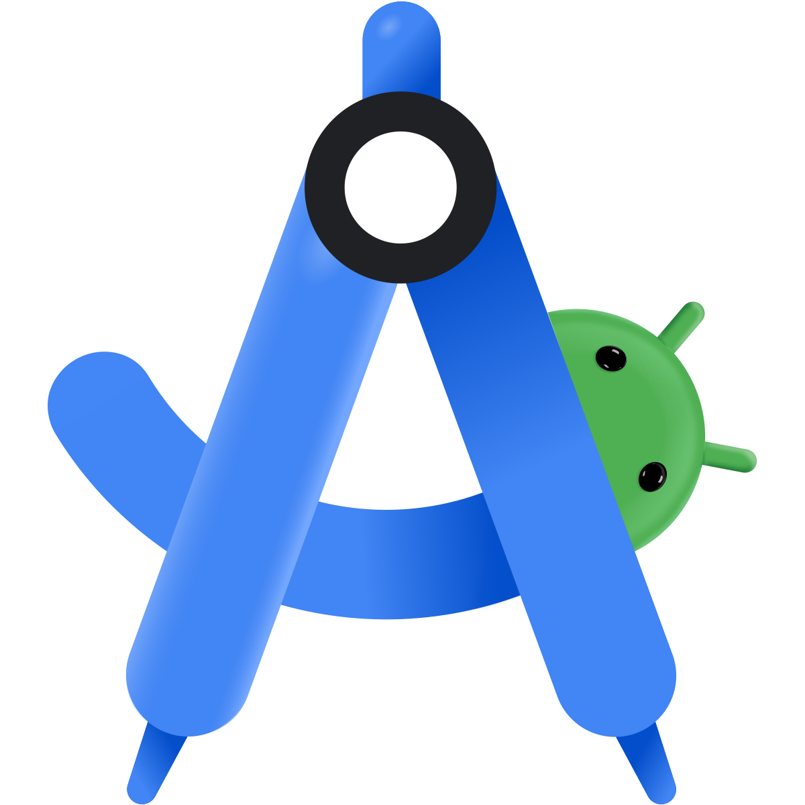
  
   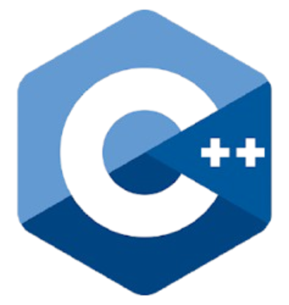
  
   
  
   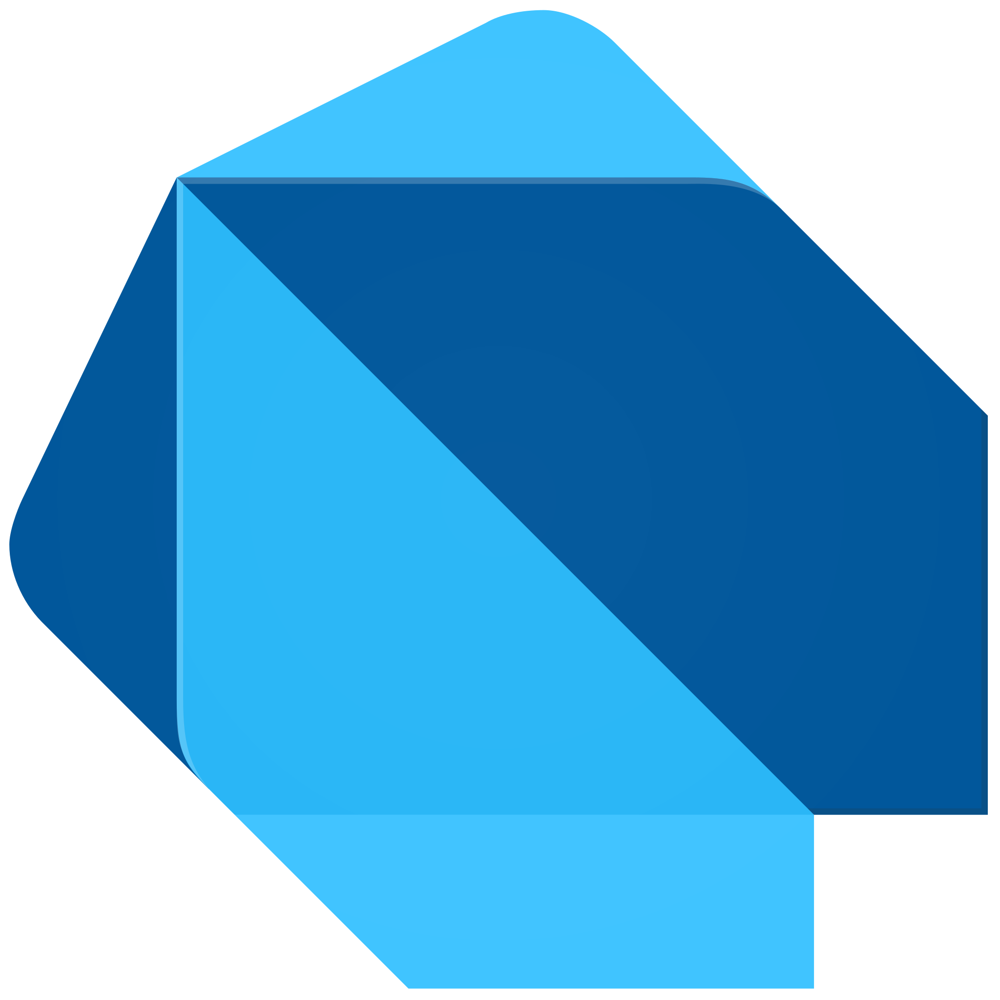
  
   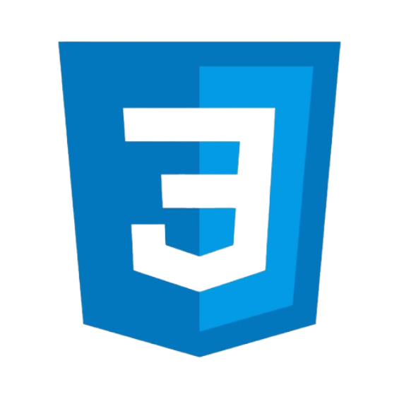
  
   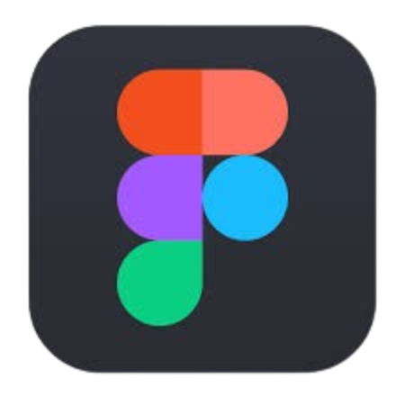
  
   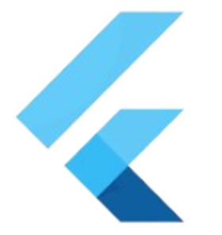
  
   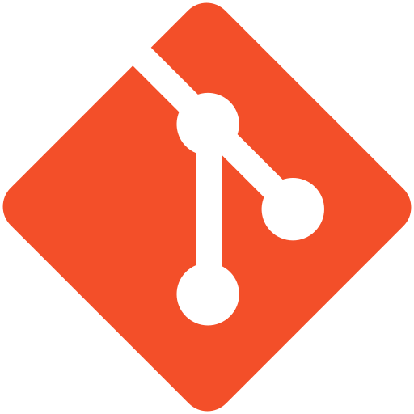
  
   
   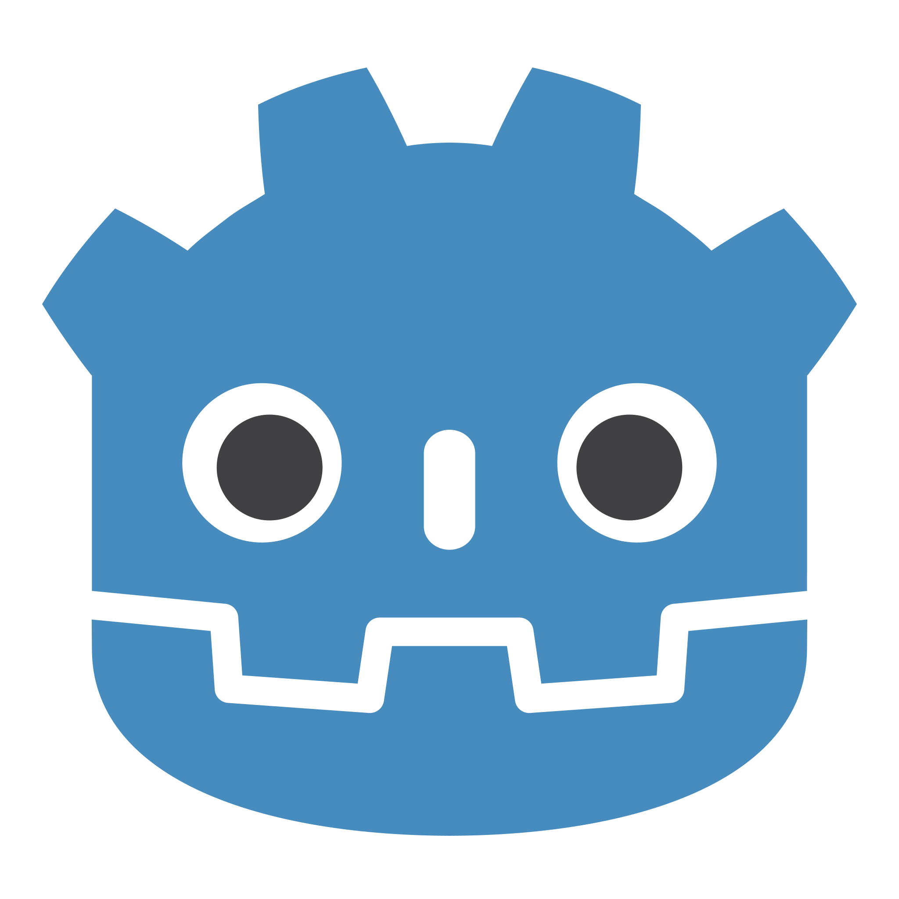
  
   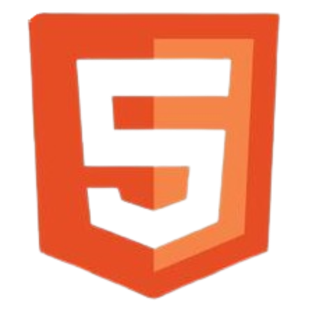
  
   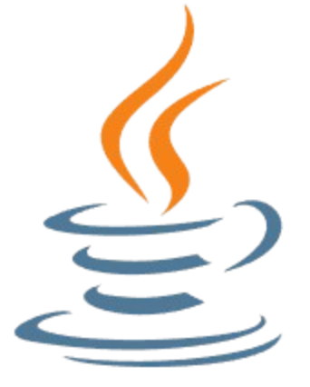
  
   
  
   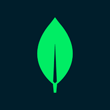
  
   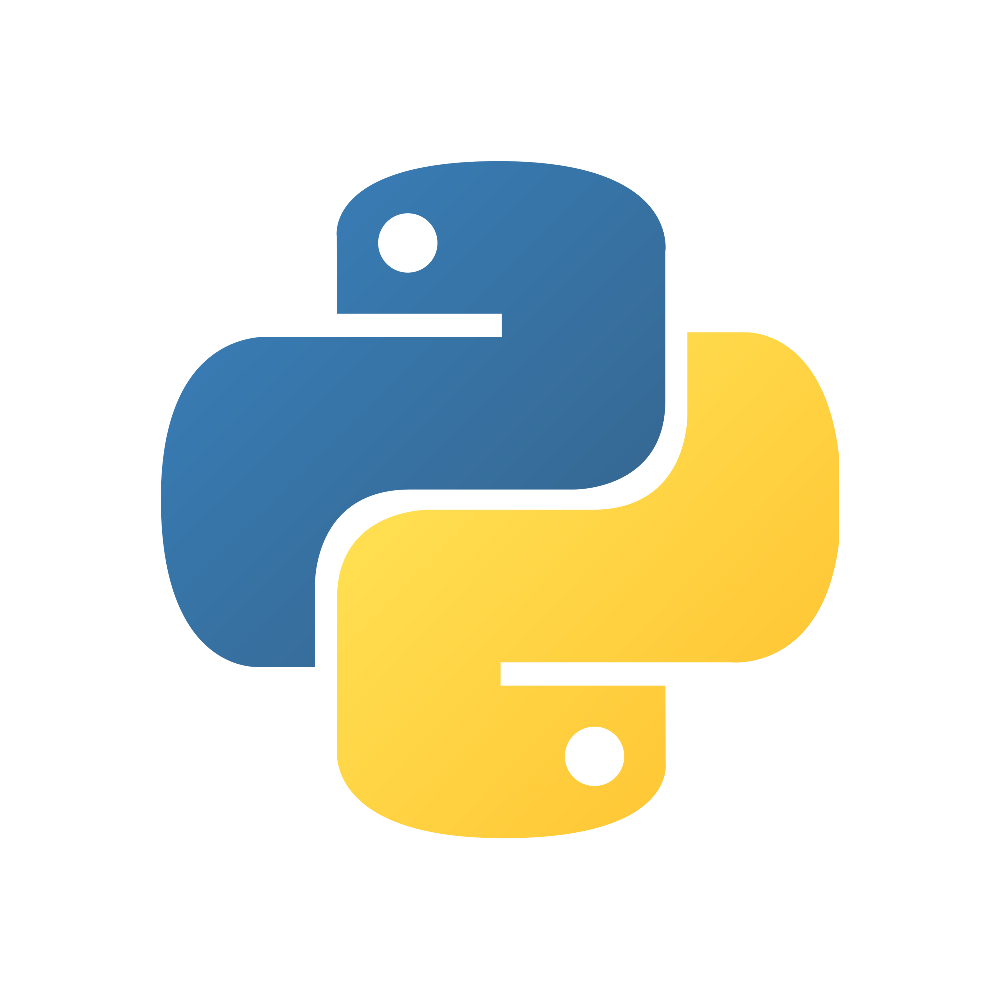
  
   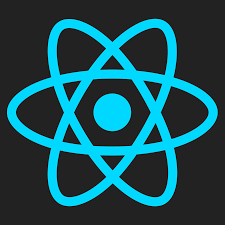
  
   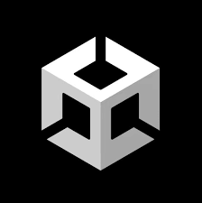
  
   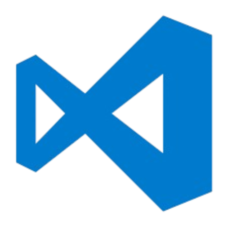
  

  

  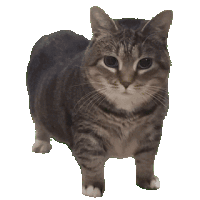
  
  

